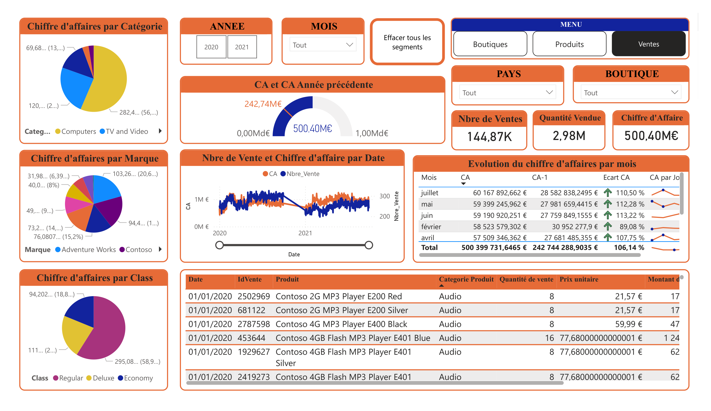
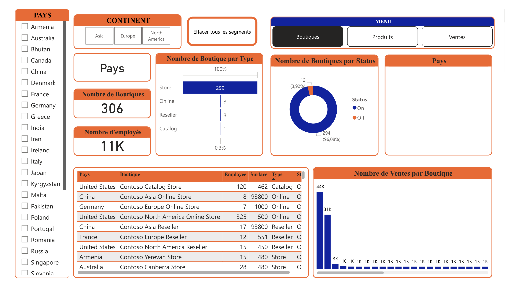

# 📊 Dashboard Power BI Multi-Boutiques International

Dashboard Power BI professionnel pour l'analyse d'un réseau de 306 boutiques internationales.

**148,000+ transactions** | **1,689 produits** | **500M€ CA** | **16 pays**

---

## 🎯 Aperçu des Dashboards

### Dashboard 1 : Ventes 

- **144,87K** ventes totales
- **2,98M** unités vendues
- **500,40M€** chiffre d'affaires
- Analyse par catégorie, marque, classe et évolution temporelle

### Dashboard 2 : Produits 

- **1,689** produits au catalogue
- Analyse retours vs ventes
- Top 3 produits les plus vendus
- Distribution par catégorie et sous-catégorie

### Dashboard 3 : Boutiques 

- **306** boutiques dans le monde
- **11K** employés
- Répartition géographique (16 pays, 3 continents)
- Performance par type (Store, Online, Reseller, Catalog)

---

## ✨ Fonctionnalités Principales

- **Navigation multi-pages** avec boutons interactifs
- **Slicers synchronisés** (Année, Mois, Pays, Boutique)
- **30+ mesures DAX** (CA, croissance %, marges, KPIs)
- **8 types de visualisations** (gauges, donut, line charts, tables)
- **Design professionnel** : Palette orange (#EB601B) / bleu marine

---

## 📂 Structure du Repository
```
Dashboard-Multi-Boutiques-International/
│
├── 📊 Dashboards/
│   ├── dashboard_page_1.png              # Boutiques
│   ├── dashboard_page_2.png              # Produits
│   └── dashboard_page_3.png              # Ventes
│
├── 📁 dataset/
│   ├── Geographie.csv                    # Données géographiques
│   ├── Boutiques.csv                     # Liste boutiques
│   ├── Produits.csv                      # Catalogue produits
│   ├── Categorie Produits.csv            # Catégories
│   ├── Sous Categories Produits.csv      # Sous-catégories
│   └── Sales/                            # Ventes par période
│       ├── Sales 2020 T1.csv
│       ├── Sales 2020 T2.csv
│       ├── Sales 2020 T3.csv
│       ├── Sales 2021 T1.csv
│       ├── Sales 2021 T2.csv
│       └── Sales 2021 T3.csv
│
├── 📄 Dashboard Boutique.pbix            # Fichier Power BI principal
├── 📄 Dashboard Boutique.pdf             # Dashboard PDF         
└── 📖 README.md                          # Ce fichier
```

---

## 🛠️ Technologies Utilisées

- **Power BI Desktop** : Création dashboards
- **Power Query / M** : ETL et transformations
- **DAX** : Mesures et calculs avancés
- **CSV** : Format données sources
- **Star Schema** : Modélisation relationnelle

---

## 📊 Modèle de Données (Star Schema)
```
         ┌──────────────┐
         │  Dim_Date    │
         │  (Calendar)  │
         └──────┬───────┘
                │
      ┌─────────┼──────────┐
      │         │          │
 ┌────▼────┐ ┌─▼───────┐ ┌▼────────────┐
 │Dim_     │ │ Fact_   │ │Dim_         │
 │Produit  │◄┤ Sales   ├►│Boutique     │
 │         │ │         │ │             │
 │1,689    │ │148,000+ │ │306          │
 │produits │ │lignes   │ │boutiques    │
 └─────────┘ └─────────┘ └─────────────┘
       │                        │
       ▼                        ▼
 ┌─────────────┐         ┌─────────────┐
 │Dim_         │         │Dim_         │
 │Categorie    │         │Geographie   │
 │             │         │             │
 │5 catégories │         │16 pays      │
 └─────────────┘         └─────────────┘
```

---

## 📐 Mesures DAX Principales
```dax
// Chiffre d'Affaires Total
CA = SUM(Sales[Montant de Vente])

// CA Année Précédente
CA-1 = CALCULATE([CA], DATEADD(Dim_Date[Date], -1, YEAR))

// Écart CA (%)
Ecart CA = DIVIDE([CA] - [CA-1], [CA-1], 0)

// Nombre de Ventes
Nbre de Ventes = COUNTROWS(Sales)

// Quantité Vendue
Quantité Vendue = SUM(Sales[Quantité de vente])

// Marge Moyenne
Avg Profit Margin = DIVIDE([Profit Total], [CA], 0)

// Taux de Retour
Taux Retour = DIVIDE(
    SUM(Sales[Quantité de retour]),
    SUM(Sales[Quantité de vente]),
    0
)
```

---

## 🚀 Installation

### Prérequis
- **Power BI Desktop** (dernière version)
- **Windows 10/11** ou **macOS** (avec Parallels)
- **4GB RAM** minimum (8GB recommandé)

### Étapes

1. **Cloner le repository**
```bash
git clone https://github.com/bouba02/Dashboard-Multi-Boutiques-International.git
cd Dashboard-Multi-Boutiques-International
```

2. **Ouvrir Power BI**
```
Dashboard Boutique.pbix
```

3. **Actualiser les données**
- Accueil → Actualiser
- Les fichiers CSV seront automatiquement chargés

4. **Explorer les 3 dashboards**
- Utiliser le menu de navigation (Boutiques, Produits, Ventes)
- Tester les slicers synchronisés

---

## 🎓 Compétences Démontrées

**Power BI :**
- ✅ Modélisation Star Schema multi-tables
- ✅ DAX avancé (Time Intelligence, CALCULATE, DIVIDE)
- ✅ Power Query (merge, append, transformations)
- ✅ Navigation multi-pages (bookmarks, buttons)
- ✅ Slicers synchronisés cross-page
- ✅ Conditional formatting dynamique

**Business Intelligence :**
- ✅ KPIs stratégiques (CA, croissance YoY, marges)
- ✅ Analyse multi-dimensionnelle
- ✅ Dashboard design professionnel
- ✅ Storytelling avec données

---

## 🤝 Contribuer

Contributions bienvenues !

1. Fork le projet
2. Créer une branche (`git checkout -b feature/NouvelleFeature`)
3. Commit (`git commit -m 'Ajout NouvelleFeature'`)
4. Push (`git push origin feature/NouvelleFeature`)
5. Ouvrir une Pull Request

---

## 📝 Licence

MIT License - Libre d'utilisation et modification.

---

## 👤 Auteur

**Boubacar Nikiema**  
Data Analyst | Power BI Expert

- 📺 YouTube: [@BoubacarDataAnalyst](https://youtube.com/@BoubacarDataAnalyst)
- 💼 LinkedIn: [Boubacar Nikiema](https://linkedin.com/in/boubacar-nikiema)
- 🌐 GitHub: [@bouba02](https://github.com/bouba02)
- 📧 Email: nikiemaboubacar@gmail.com

---

## 🎯 Cas d'Usage

Template adaptable pour :
- 🏪 Retail multi-magasins
- 🛒 E-commerce (performance produits)
- 📦 Distribution (analyse réseau)
- 💼 Consulting BI (template clients)

---


<div align="center">

**Made by Boubacar Nikiema | © 2026**

*Learning in Public - Partageons la connaissance*

[⭐ Star ce repo](https://github.com/bouba02/Dashboard-Multi-Boutiques-International) • [📺 YouTube](https://youtube.com/@BoubacarDataAnalyst) • [💼 LinkedIn](https://linkedin.com/in/boubacar-nikiema)

</div>
