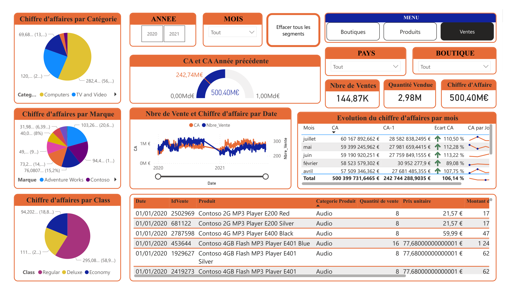
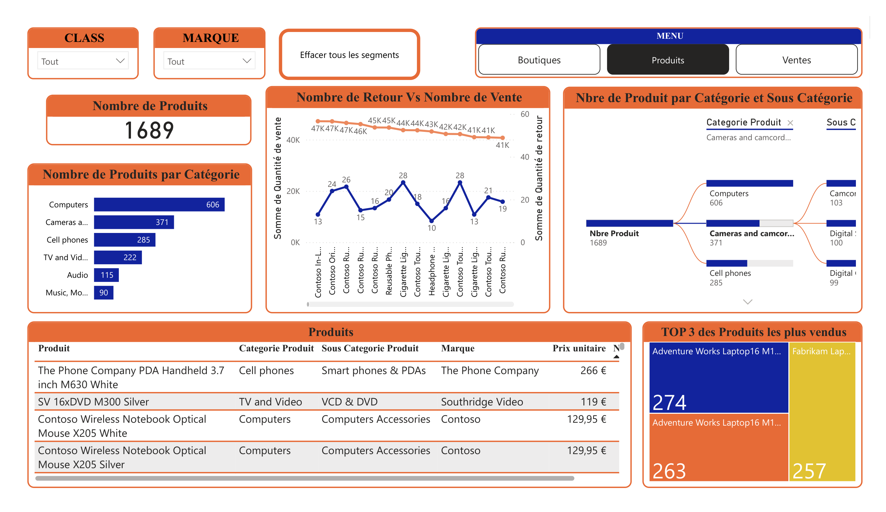
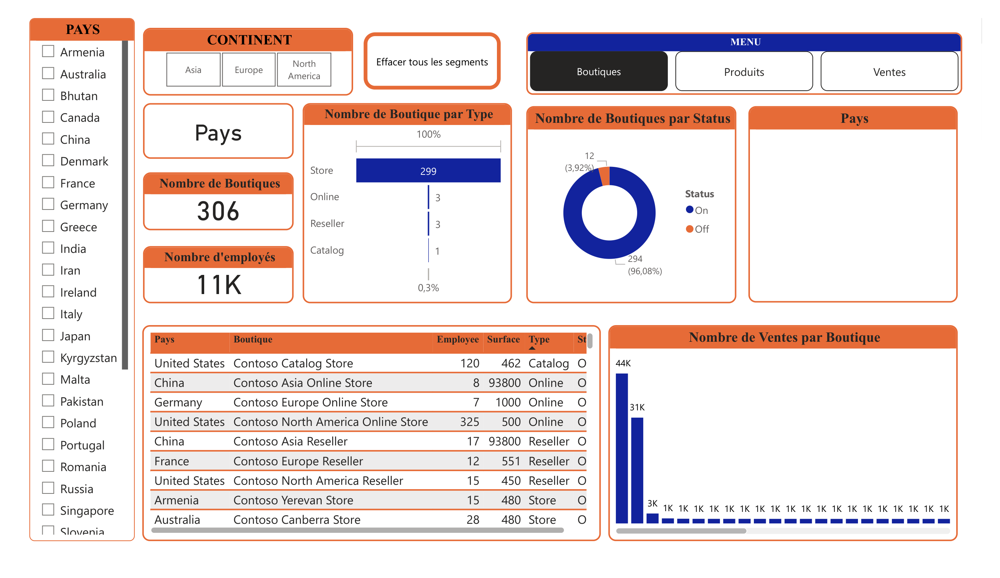

# International Retail Dashboard — 306 Stores · 16 Countries | Power BI

> **€500M revenue · 148,000 transactions · 1,689 products · 3 continents**  
> 3 dashboards · 30+ DAX measures · 6-table Star Schema · Time Intelligence

🇫🇷 [Version française disponible ici](README_FR.md)

---

## Project Context

Performance analysis of an international retail network of 306 stores operating
across 16 countries and 3 continents — covering sales, product catalog, and
store performance over 2 years (2020–2021).

**Scope:**

| Dimension | Value |
|---|---|
| Total Revenue | **€500.40M** |
| Transactions | **148,000+** |
| Products | **1,689** |
| Stores | **306** (Store · Online · Reseller · Catalog) |
| Countries | **16** — 3 continents |
| Employees | **11,000** |

---

## Dashboards — 3 Pages

### Dashboard 1 — Sales

Revenue · Units sold · YoY growth · Analysis by category, brand and class · Time evolution

### Dashboard 2 — Products

1,689-product catalog · Returns vs sales analysis · Top 3 products · Category and subcategory distribution · Return rate by segment

### Dashboard 3 — Stores

306 stores · Geographic breakdown (16 countries · 3 continents) · Performance by channel type · 11,000 employees

---

## Data Model — Star Schema

```
              [Dim_Date]
                  │
      ┌───────────┼───────────┐
      │           │           │
[Dim_Product] [Fact_Sales] [Dim_Store]
  1,689 refs   148,000+    306 stores
      │          rows           │
      ▼                         ▼
[Dim_Category]           [Dim_Geography]
  5 categories              16 countries
```

**6 tables · Many-to-One relationships · Cross-page synchronized filters**

---

## DAX Measures — 30+

```dax
// Revenue
Revenue = SUM(Sales[Montant de Vente])

// Prior year comparison
Revenue_PY = CALCULATE([Revenue], DATEADD(Dim_Date[Date], -1, YEAR))

// YoY Growth
Revenue_Growth_% = DIVIDE([Revenue] - [Revenue_PY], [Revenue_PY], 0)

// Volume
Nb_Sales        = COUNTROWS(Sales)
Units_Sold      = SUM(Sales[Quantité de vente])

// Profitability
Avg_Profit_Margin = DIVIDE([Total Profit], [Revenue], 0)

// Quality
Return_Rate = DIVIDE(
    SUM(Sales[Quantité de retour]),
    SUM(Sales[Quantité de vente]),
    0
)
```

**Advanced patterns:** Time Intelligence · CALCULATE · DATEADD · DIVIDE · Dynamic conditional formatting

---

## Dashboard Features

- Multi-page navigation with interactive buttons
- Cross-page synchronized slicers (Year · Month · Country · Store)
- 8 visualization types (gauges · donut · line charts · tables · bars)
- Cohesive design — orange `#EB601B` / navy blue

---

## Tech Stack

- **Power BI Desktop** — 3 dashboards, multi-page navigation
- **Power Query / M** — consolidation of 6 quarterly CSV files (2020–2021)
- **DAX** — 30+ measures with Time Intelligence
- **Star Schema** — 6 tables, multi-dimensional modeling

---

## Quick Start

```bash
git clone https://github.com/bouba02/Dashboard-Multi-Boutiques-International.git
```

Open `Dashboard Boutique.pbix` in Power BI Desktop.  
`Home → Refresh` — CSV files load automatically.

---

## Repository Structure

```
Dashboard-Multi-Boutiques-International/
├── README.md
├── README_FR.md
├── Dashboard Boutique.pbix
├── Dashboard Boutique.pdf
├── Dashboards/
│   ├── dashboard_page_1.png    # Stores
│   ├── dashboard_page_2.png    # Products
│   └── dashboard_page_3.png    # Sales
└── dataset/
    ├── Geographie.csv
    ├── Boutiques.csv
    ├── Produits.csv
    ├── Categorie Produits.csv
    ├── Sous Categories Produits.csv
    └── Sales/
        ├── Sales 2020 T1.csv … Sales 2021 T3.csv
```

---

## Author

**Boubacar Nikiema** — Data Analyst & BI Consultant

Specialized in retail & distribution dashboards, multi-entity analytics and performance
management using Power BI, SQL, Python and Excel. Based in Morocco, working with
clients across Africa and French-speaking Europe.

[](https://linkedin.com/in/boubacar-nikiema)
[](https://youtube.com/@BoubacarDataAnalyst)
[](mailto:nikiemaboubacar@gmail.com)
[](https://data.ngroupmediadigital.com)

---

*Simulated data · Code: MIT License*
